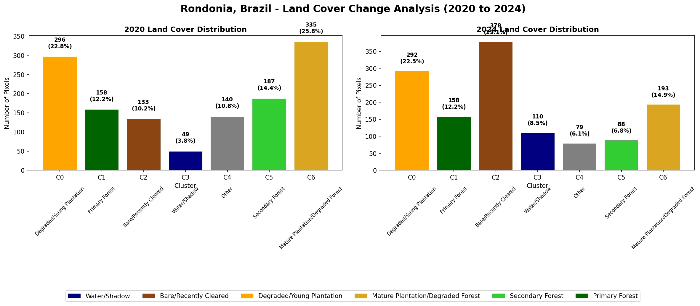
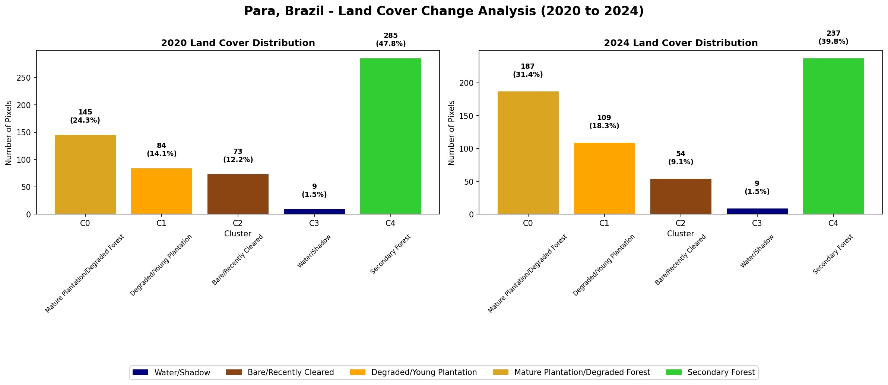

# Detecting Deforestation in the Amazon Regions of Para and Rondonia Using K-means Unsupervised Learning 

## Table of contents

## Project Overview

## Background and Motivation 

The Amazon rainforest is one of the most crucial biomes on the planet, often called the “lungs of the Earth” due to its ability to regulate Earth’s climate. The Amazon is a colossal 6.7 million square kilometres stretching across nine South American countries and is host to over 30,000 plants, it is the most diverse ecosystem on Earth (Ferreira, 2026). In addition to this, the Amazon is the biggest land sink of Carbon and is estimated to store 140 billion tonnes of carbon (Greenpeace, 2020). However, since the 1970s rapid land-use change has meant that deforestation has been occurring at accelerating rates in order to meet population demand, in 2019 alone there was a 34 % increase in forest clearing from the previous year (Santos et al., 2024 , Teixeira et al., 2025). Without proper policy it is estimated that deforestation could reach up to 50% of the 2050 (Borma, Nobre and Cardoso, 2013).  

Deforestation has huge consequences on the Amazon rainforest and the Earth system as a whole. Recent studies suggest that deforestation, forest damage, and climate change have caused parts of Southeastern Amazonia to shift from absorbing carbon dioxide from the atmosphere to releasing more carbon than they store, amplifying initial perturbations (Teixeira et al., 2025). The lower number of trees reduces atmospheric moisture, altering precipitation patterns across the Amazon region by causing longer dry seasons and more frequent droughts (Borma, Nobre and Cardoso, 2013). This increases the Amazon’s vulnerability to wildfires, which further destroy ecosystems and threaten biodiversity (Borma, Nobre and Cardoso, 2013). 

Given the scale and urgency of Amazon deforestation, effective monitoring is essential for informing conservation policy. Knowing the rate, location and type of forest loss is therefore the first and most fundamental step toward slowing it and hold high-deforestation regions accountable. Traditional ground-based surveys are logistically challenging, expensive, and unable to provide the spatial coverage needed to track deforestation across millions of square kilometres. Satellite remote sensing offers a powerful alternative,repeatable, and low-cost monitoring of land cover change at regional scale. This project leverages freely available Sentinel-2 multispectral imagery accessed via Google Earth Engine to apply K-means unsupervised machine learning to detect and quantify forest loss.

## Data Acquisition and Study Area

The dataset used in this study consists of Sentinel-2 Level-2A surface reflectance imagery, accessed via Google Earth Engine (GEE) through the ESA Copernicus programme. Sentinel-2 was selected for its 10 m spatial resolution, 5-day revisit time, and 13 spectral bands covering visible, near-infrared and shortwave infrared wavelengths, making it well suited for vegetation analysis and land cover change detection at landscape scale (CDSE, 2023).

The notebook automatically selects the least cloudy available image for each region and year by searching the full calendar year and ranking by cloud cover percentage. Manual override functionality is also included to allow selection by index where the automatic choice had unfavourable cloud conditions over the specific study area. This was necessary for the Pará region where the default images were heavily masked, requiring dry season images to be selected manually.

Brazil was selected as the study country as it contains the largest area of tropical rainforest in the world and has the highest absolute rates of deforestation globally, making it one of the largest national emitters of greenhouse gases from land use change (Santos et al., 2024; Ferreira, 2026).

**Sentinel-2 Satellite Images of Cacoal, Rondônia, Brazil**

**Location:** Central Rondônia deforestation hotspot

**Coordinates:** 11.45° S, 61.1° W

**Bounding box:** [-61.3, -11.6, -60.9, -11.3]

**Characteristics:** Rondônia is located in Western Brazil, it is characterised by the distinctive fishbone deforestation pattern where agricultural clearings branch off road networks into intact forest and records among the highest deforestation rates in Brazil (Ferraz, Vettorazzi and Theobald, 2009)

**Image 1 (Baseline):** 2020 dry season

**Image 2 (Recent):** 2024 dry season

**Sentinel-2 Satellite Images of Altamira, Pará, Brazil**

**Location:** Altamira municipality, southern Pará

**Coordinates:** 3.65° S, 52.2° W

**Bounding box:** [-52.4, -3.8, -52.0, -3.5]

**Characteristics:** Pará is the second largest state in Brazil and is consistently identified as one of the most deforested municipalities in the entire Amazon basin (Ferraz, Vettorazzi and Theobald, 2009). The region sits on an active agricultural frontier where primary forest is being converted to cattle pasture and smallholder agriculture at high rates. 

**Image 1 (Baseline):** 2020 dry season

**Image 2 (Recent):** 2024 dry season

*Figure 1: *

## Methodology 

**Cloud Masking**

A cloud masking function was applied to all images using Sentinel-2's Scene Classification Layer (SCL). Pixels classified as cloud shadow (class 3), medium probability cloud (class 8), high probability cloud (class 9), and cirrus (class 10) were excluded. A deliberately lenient masking strategy was adopted to retain maximum usable pixels in the frequently cloudy equatorial environment, removing only the most obvious atmospheric contamination.

**Vegetation Index Calculation**

Rather than clustering on raw spectral bands, four vegetation indices were calculated from the Sentinel-2 bands to form the feature space for K-means (Huete et al., 2002). This improves physical interpretability of the resulting clusters and reduces sensitivity to illumination differences between the 2020 and 2024 acquisitions

NDVI (Normalised Difference Vegetation Index) — the primary forest cover indicator

EVI (Enhanced Vegetation Index) — preferred over NDVI in dense tropical forest where NDVI saturates

SAVI (Soil Adjusted Vegetation Index) — reduces soil background effects in recently cleared areas

NDMI (Normalised Difference Moisture Index) — captures vegetation water content, distinguishing stressed or degraded forest from healthy canopy

​
**Training Data Extraction**

2,000 random pixels were sampled from each study region at 30 m resolution using GEE's .sample() method. Both years were combined into a single image before sampling, ensuring each pixel row contains co-located vegetation index values from both 2020 and 2024 at the exact same geographic location. A fixed random seed (seed=42) was used throughout to ensure reproducibility.

**K-Means Clustering**

The notebook utilizes an unsupervised machine learning algorithm called **"k-means clustering"** , this algorithm that groups data into K clusters by assigning unlabelled data points to the nearest centroid (cluster centre). Here we apply this to the four vegetation indices to classify land cover types without requiring labelled training data. 

**Optimal cluster selection** was determined objectively using silhouette analysis, testing k = 5, 6 and 7 clusters. The silhouette score measures how similar each pixel is to its own cluster compared to neighbouring clusters, ranging from -1 to +1 where higher values indicate better-separated clusters. The k value producing the highest silhouette score was selected — k=7 for Rondônia (silhouette = 0.437) and k=5 for Pará (silhouette = 0.312).

**Temporal consistency** was ensured by training the K-means model exclusively on 2020 data and applying the same fitted model to both years. This is a critical methodological decision, if the model were retrained on 2024 data independently, the cluster boundaries would shift and any differences in pixel counts could reflect algorithmic variation rather than genuine land cover change. Therefore, all changes in pixel counts between years reflect real land cover transitions.

**Land Cover Label Assignment**

Land cover labels were assigned to clusters based on their centroid NDVI value using thresholds adapted from the course methodology (Tsamados and Chen, 2022).

| Land Cover Type | NDVI Range |
|---|---|
| Water / Shadow | < 0.1 |
| Bare / Recently Cleared | 0.1 – 0.35 |
| Degraded / Young Plantation | 0.35 – 0.55 |
| Mature Plantation / Degraded Forest | 0.55 – 0.70 |
| Secondary Forest | 0.70 – 0.85 |
| Primary Forest | > 0.85 |

**Change Detection**

Deforestation metrics were derived by comparing pixel counts between 2020 and 2024 for each land cover type. Three key indicators were calculated: total forest loss (decrease in Primary and Secondary Forest pixels), new clearing (increase in Bare/Recently Cleared pixels), and plantation expansion (increase in plantation category pixels). An annualised deforestation rate was calculated by dividing total forest loss as a percentage of total pixels by the four year study period.

## Results and Performance

**Rondonia Results**

Rondônia shows clear evidence of active deforestation between 2020 and 2024, with dramatic increases in recently cleared land consistent with the rapid agricultural expansion this region is known for.

* Achieved a silhouette score of 0.383 which shows that K-means found some distinct groups however there is overlap between neighbouring land types.
* Bare/recently cleared land increased by 184 % from 2020 to 2024
* Secondary Forest decreased by 53%
* Mature plantation/degraded forest decreased by 42 % suggests land that was already used for agriculture may have been abandoned or reclassified.

*Figure 1: Land cover change analysis for Rondônia, Brazil (2020–2024)*

**Para Results**

Pará tells a different story to Rondônia, rather than active clearing, the results suggest a more advanced stage of land conversion where previously cleared areas are transitioning into established agriculture.

* Only 596 pixels were used compared to 1298 in Rondonia most likely due to cloud masking removing pixels
* Higher silhouette score of 0.476, suggests clusters are more distinct
* Degraded/Mature forest increased by 30% suggests forest converted to agricultural land
* Mature plantation/degraded forest increased by 29% suggests young plantations have matured since 2020
* Secondary forest dereased by 17%
* No primary forest cluster appears

*Figure 1: Land cover change analysis for Para, Brazil (2020–2024)*

## Environment Impact Assesment 

## Limitations 

* **Oversimplication of landscapes** K-means partitions data into spherical clusters, however real land cover types don't naturally form spherical clusters. The model only uses four vegetation indices.
* **Sample size and cloud cover** the study relies on 2000 pixels due to computational limitations and with cloud cover even less, however it may not be representative of deforestation trends across an entire region.
* **Seasonal Mismatch** if the 2020 and 2024 images were acquired in different seasons, some NDVI differences between years may reflect seasonal vegetation change rather than permanent land cover change.
* **No uncertainty quantification** K-means assigns Pixels sitting on the boundary between two clusters get assigned just as confidently as pixels sitting firmly in the centre of a cluster.

## Future work

Some ideas for future work to improve the model:

* **Compare with supervised approaches** this would directly quantify what is gained by adding ground truth labels
* **Try alternative clustering algorithms** Gaussian Mixture Models would address the spherical cluster assumption by allowing clusters of different shapes and sizes.
* **Multi-temporal compositing** using a seasonal median composite rather than a single image would reduce noise from atmospheric effects and produce more stable vegetation index values for clustering.
